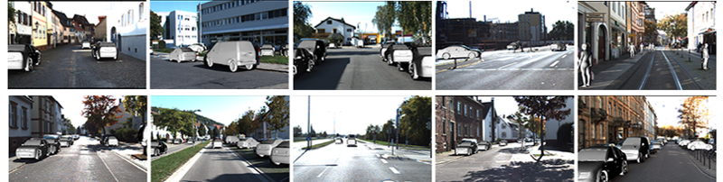

## Purpose

We human beings can do 3D reconstruction from single image. Instead of depth estimation from image, we humans beings seems to use a different way, which is to call 3D model in mind, re-align these 3D models and change hyper-parameters of 3D models in the virtual world of our brain. Therefore, why not try to find a way to realign 3D models by single image instead of directly estimating depth. 


In this work, we try to find a **way to re-align 3D models in 3D space guided by the single images**.  There are two steps needs to be done, as follows:

- Image-guided 3D Re-Alignment: object detection, 3D model matching, and 3D model pose estimation.
- Image-guided 3D Hyper-parameter of variants model estimation. 


## Framework


***

## Roadmap

| Task Name                | Start/End Date        | Des                                                         |
| ------------------------ | --------------------- | ----------------------------------------------------------- |
| Labeling                 | 2021/8/1 - now        | Start Labeling image with 3D vehicle model                  |
| Optimize the label tools | 2021/6/1 - 2021/7/30  | Make the tools easy to use                                  |
| Create the label tools   | 2021/3/3 - 2021/5/30  | Complete the creation of LabelImg3D                         |
| Collect 3D Model         | 2021/1/12 - 2021/3/1  | Collect 3D vehicle model for this idea                      |
| Design the label tools   | 2020/12/10 - 2021/3/2 | Start the idea of 3D detection and tracking in single image |

***

## Run Label Tools
There are two ways for installing the labeltools:
```sh
conda create -n labelimg3D python=3.8
```
1. install from the released .exe

or 

2. run from the code, by the following sh

```sh
conda create -n pylabelimg3D python=3.8
pip install -r requirement.txt
conda activate pylabelimg3D
python main.py
```

## Package
If you want to make the installer, you can use the `pyinstaller`. Try the following command:

```sh
pip install pyinstaller
pyinstaller --clean -y LabelImg3D.spec
```

## Data preparation
Please download the [demo scene](./scenes/KITTI) and open with LabelImg3D.  
```
Scenes
├── Scene1
│   ├── images
│   │   ├──  000000.png ......
│   ├── models
│   │   ├── Car.obj bus.obj ......
|   ├── annotations
|   │   ├── 000000.json ......
├── Scene2
├── ├── images
│   │   ├── ......

``` 

## Hotkeys

| Hot key                  | Description                          | 
| ------------------------ | ------------------------------------ | 
| Ctrl + s                 | Save                                 | 
| Ctrl + o                 | Load scenes                          |
| Ctrl + c                 | Copy model                           | 
| Ctrl + v                 | Paste model                          | 
| Ctrl + Space             | Copy Scene                           | 
| 1                        | Previous image                       | 
| Space                    | Next image                           | 
| x                        | Delete Model                         |
| w                        | Rotate around the positive x-axis    |
| s                        |Rotate around the negative x-axis     |
| e                        | Rotate around the positive y-axis    |
| q                        |Rotate around the negative y-axis     |
| a                        | Rotate around the positive z-axis    |
| d                        |Rotate around the negative z-axis     |


## Dataset

This is a dataset named [KITTI3D](https://drive.google.com/file/d/1eXtvURnTQbwCmiKDfhsWdGxfkv5Qqgep/view?usp=sharing)



***

## Third-Party Library

|                         name                          |       desc        |
| :---------------------------------------------------: | :---------------: |
| [pyqtconfig](https://github.com/learnpyqt/pyqtconfig) | for gui configure |

***

## License
The methods provided on this page are published under the [Creative Commons Attribution-NonCommercial-ShareAlike 3.0 License](http://creativecommons.org/licenses/by-nc-sa/3.0/) . This means that you must attribute the work in the manner specified by the authors, you may not use this work for commercial purposes and if you alter, transform, or build upon this work, you may distribute the resulting work only under the same license. If you are interested in commercial usage you can contact us for further options.


