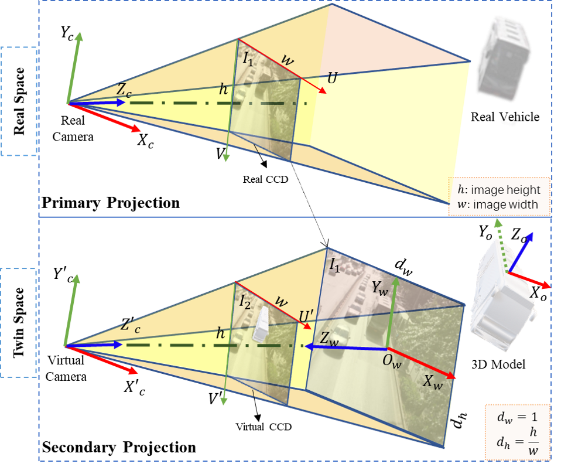

<h1 align="center">
  <br/>labelImg3D
</h1>


<h4 align="center">
  RGB Image Object Pose Annotation with Python
</h4>


<br/>

<div align="center">
  
</div>


##  Description
LabelImg3D is a labeling tool for image graphics. 
It is written in Python and uses Qt for its graphical interface. 
The annotations are saved as json files and used in the SMPOE network.

<div align="center">
  
</div>

<br/>

## Purpose 

We human beings can do 3D reconstruction from single image. Instead of depth estimation from image, we humans beings seems to use a different way, which is to call 3D model in mind, re-align these 3D models and change hyper-parameters of 3D models in the virtual world of our brain. Therefore, why not try to find a way to realign 3D models by single image instead of directly estimating depth. 

In this work, we try to find a **way to re-align 3D models in 3D space guided by the single images**.  There are two steps needs to be done, as follows:

- Image-guided 3D Re-Alignment: object detection, 3D model matching, and 3D model pose estimation.
- Image-guided 3D Hyper-parameter of variants model estimation.  

<div align="center">
  
</div>

***


## Features
- [x] Image annotation of the object's true pose relative to the camera.
- [x] Annotation of the target's 2D boxes and 3D boxes in the image.
- [x] GUI customization (predefined labels, auto-saving,  etc). 
- [x] Exporting linemod dataset for 6D Pose Estimation. 

***

## Requirements
- Ubuntu / macOS / Windows
- Python3
- [PyQt5](http://www.riverbankcomputing.co.uk/software/pyqt/intro)
- VTK
- numpy
- pandas
- scipy
- PyYAML
- opencv-python

***

## Installation
### Install labelImg3D
There are two ways for installing the labeltools:
```sh
conda create -n labelimg3D python=3.8
```
1. install from the released .exe

or 

2. run from the code, by the following sh

```sh
conda create -n pylabelimg3D python=3.8
pip install -r requirements.txt
conda activate pylabelimg3D
python main.py
```

### Packages
If you want to make the installer, you can use the `pyinstaller`. Try the following command:

```bash
pip install pyinstaller
pyinstaller --clean -y LabelImg3D.spec
```

***

## Usage
### Data Preparation
Please download the [demo scene](./scenes/KITTI) and open with LabelImg3D.  
```
Scenes
├── Scene1
│   ├── images
│   │   ├──  000000.png ......
│   ├── models
│   │   ├── Car.obj bus.obj ......
|   ├── annotations
|   │   ├── 000000.json ......
├── Scene2
├── ├── images
│   │   ├── ......

```
### Run LabelImg3D
```bash
labelImg3D  # open gui
```
or
```bash
python3 labelImg3D.py
```

### Steps
1. Build and launch using the instructions above.
2. Click 'Load Scenes' in Menu/File, and choose the scene folder as [Data Preparation](#data).
3. Click 'System Config' in Menu/Config.
4. Click "camera" at System_config Page, and set the FOV to the field of view of the camera taking the scene images. 
5. Click "model" at System_config page, and you can set the initial position, max position, position accuracy, size accuracy, scaling factor of the model.
   * initial position: The initial position of the model loaded into the scene.
   * max position: The position of the model in the scene closest to the camera. Moving the model beyond this position resets the model to its initial position during the move.
   * position accuracy: Display accuracy of model x,y,z position, located in 3DProperty module.
   * size accuracy: Display accuracy of model size(w, l, h), located in 3DProperty module.
   * scaling factor: Model movement speed in Z-axis.
6. Click the model name at Models module, and we can see the model loaded to its initial position.

   * If a model is selected and loaded as described above, if both model categories are the same, the new model will be loaded to the selected model location.
7. You can press the Shift key and press the left mouse button to select the model and move the mouse position to move the model in X and Y axis.
8. You can press the right mouse button to select the model and move the mouse position to move the model in the Z-axis.
9. In the visual perception of the human eye, object labeling is considered to be over when the model in the scene completely overlaps with the image object.

The annotation will be saved to the Scenes/<Your Scene>/annotations.

You can refer to the below hotkeys to speed up your workflow.  


### Hotkeys

| Hot key                  | Description                          |
| ------------------------ | ------------------------------------ |
| Ctrl + s                 | Save                                 |
| Ctrl + o                 | Load scenes                          |
| Ctrl + c                 | Copy model                           |
| Ctrl + v                 | Paste model                          |
| Ctrl + Space             | Copy Scene                           |
| 1                        | Previous image                       |
| Space                    | Next image                           |
| x                        | Delete Model                         |
| Shift + Left Mouse Button Move                        | Move the model along X, Y axis |
| Right Mouse Button Move | Move the model along Z axis |
| w                        | Rotate around the positive x-axis    |
| s                        |Rotate around the negative x-axis     |
| e                        | Rotate around the positive y-axis    |
| q                        |Rotate around the negative y-axis     |
| a                        | Rotate around the positive z-axis    |
| d                        |Rotate around the negative z-axis     |


### Label Annotations
The annotation files contain 3 main sections, as follows:  

Annotation.json  
├── image_file   [<sup>1</sup>](#R1): "images/0000.png"   
├── model  [<sup>2</sup>](#R2)  
│   ├── num  [<sup>3</sup>](#R3): 5  
│   ├── 0  [<sup>4</sup>](#R4)  
│   │   ├── model_file  [<sup>5</sup>](#R5): "models/Car.obj"  
│   │   ├── matrix: [0, …, ] 					# (16x1) matrix  [<sup>6</sup>](#R6)  
│   │   ├── R_matrix_c2o:[0, …, ] 				# (9x1) matrix  [<sup>7</sup>](#R7)  
│   │   ├── T_matrix_c2o:[0, …, ] 				# (3x1) matrix  [<sup>8</sup>](#R8)  
│   │   ├── 2d_bbox: [700, …, ]					# (4x1) matrix  [<sup>9</sup>](#R9)  
│   │   ├── 3d_bbox: [[721,500] …, ]			# (8x2) matrix  [<sup>10</sup>](#R10)  
│   │   ├── 3d_bbox_w: [[3.8, 2.4, 1.4],…，]		#(3x1) matrix  [<sup>11</sup>](#R11)  
│   │   ├── class: 1 							# object class num [<sup>12</sup>](#R12)  
│   │   ├── class_name: Car 					# object class name  [<sup>13</sup>](#R13)  
│   │   ├── size: [1.99, 1.55, 18.24]			# (3x1) matrix  [<sup>14</sup>](#R14)  
│   ├── 1[<sup>4</sup>](#R4)  
│   │   ├── model_file  [<sup>5</sup>](#R5): "models/Car.obj"  
│   │   ├── ......   
├── camera  [<sup>15</sup>](#R15)  
│   ├── matrix: [1.0, …, ] 						# (16x1) matrix  [<sup>16</sup>](#R16)  
│   ├── position: [0.0, 0.0, 0.52]				# (3x1) matrix  [<sup>17</sup>](#R17)  
│   ├── focalPoint: [0.0, 0.0, 0.0]				# (3x1) matrix  [<sup>18</sup>](#R18)  
│   ├── fov: 88.0								# camera fov  [<sup>18</sup>](#R18)  
│   ├── viewup: [0.0, 1.0, 0.0]					# camera viewup  [<sup>18</sup>](#R18)  
│   ├── distance: 0.52							# camera distance  [<sup>18</sup>](#R18)  

</br>

<div><a name="R1"></a>
1. image_file: The labeled image file path.  
</div>

<div><a name="R2"></a>
2. model: Labeling results of objects
</div>

<div><a name="R3"></a>
3. model──num: The number of objects
</div>

<div><a name="R4"></a>
4. 0, 1, 2...: each labeled object 
</div>

<div><a name="R5"></a>
5. model_file: the object model path
</div>

<div><a name="R6"></a>
6. matrix:  the pose of object in twin space
</div>

<div><a name="R7"></a>
7. R_matrix_c2o: Rotation matrix of the object from its own coordinate to the camera coordinate. 
</div>

<div><a name="R8"></a>
8. T_matrix_c2o: Translation matrix of the object from its own coordinate to the camera coordinate.
</div>

<div><a name="R9"></a>
9. 2d_bbox:  2D bounding box of the object in the image.
</div>

<div><a name="R10"></a>
10. 3d_bbox: 3D bounding box of the object in the image.
</div>

<div><a name="R11"></a>
11. 3d_bbox_w: 3D bounding box of the object in the camera coordinate in twin space.
</div>

<div><a name="R12"></a>
12. class: the object class number.
</div>

<div><a name="R13"></a>
13. class_name: the object class name.
</div>

<div><a name="R14"></a>
14. size: the object size (Unit: meter).
</div>

<div><a name="R15"></a>
15. camera: 
</div>

<div><a name="R16"></a>
16. matrix: the pose of camera in twin space.
</div>

<div><a name="R17"></a>
17. position: the position of the camera in twin space.
</div>

<div><a name="R18"></a>
18. focalPoint, fov, viewup, distance: Camera parameters
</div>


***


## Dataset

This is a dataset named [KITTI3D](https://drive.google.com/file/d/1wFcWEl4Pkj9H-MEd5Tc_5Ld9KCRje9Jm/view?usp=sharing)


## Framework


***


## Developing

```bash
git clone https://github.com/CongliangLi/LabelImg3D.git
cd labelImg3D
```
***

## Third-Party Library

|                         name                          |       desc        |
| :---------------------------------------------------: | :---------------: |
| [pyqtconfig](https://github.com/learnpyqt/pyqtconfig) | for gui configure |

***

## Author Home
[Congliang Li](https://github.com/CongliangLi)  
[Shijie Sun](https://js.chd.edu.cn/xxgcxy/ssj102/list.psp)

## License
The methods provided on this page are published under the [Creative Commons Attribution-NonCommercial-ShareAlike 3.0 License](http://creativecommons.org/licenses/by-nc-sa/3.0/) . This means that you must attribute the work in the manner specified by the authors, you may not use this work for commercial purposes and if you alter, transform, or build upon this work, you may distribute the resulting work only under the same license. If you are interested in commercial usage you can contact us for further options.


**Commercial Cooperation, Contact [shijieSun@chd.edu.cn](mailto:shijieSun@chd.edu.cn)**
