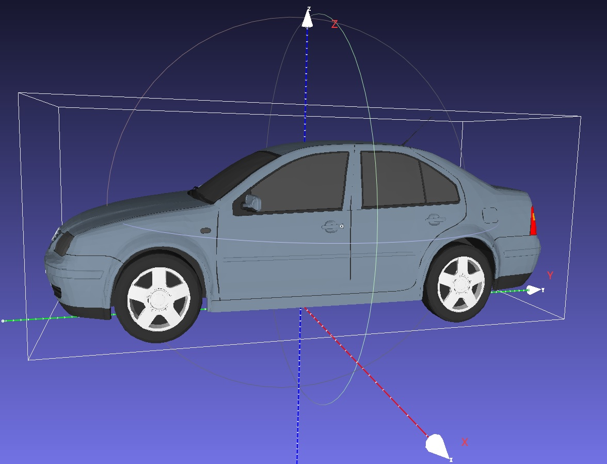
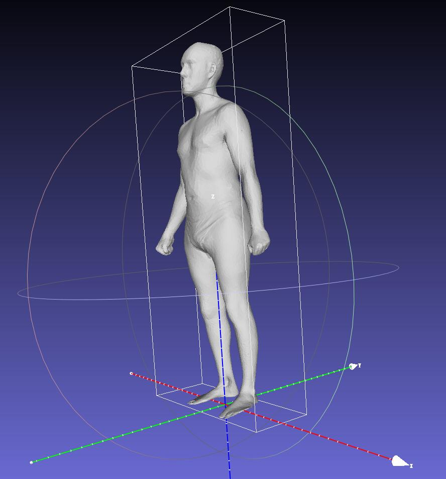

# KITTI
We propose a dataset, named "kitti-img3D", which is based on the kitti 3D object detection dataset.

## Model List
We use the following models

| Model Name | Class Name | Class Index | Model Size (LxWxH) | Source| Model Demo|
|:---:|:---:|:---:|:---:|:---:|:---:|
| tram_001.obj| Tram | 1 | $15.21\times 2.37 \times 3.62$   | [1] |  |
| car_001.obj| Car | 2 | $3.84\times 1.64 \times 1.50$   | [1] |  | [1] | 
| truck_001.obj| Truck | 3 | $5.8\times 2.63 \times 2.85$   | [1] |  | [1] |
| van_001.obj| Van | 4 |  $4.62\times 1.88 \times 2.06$  | [1] |  | [1] |
| pedestrian_001.obj| Pedestrian | 5 | $0.91 \times 0.32 (0.66) \times 1.76$ | [2] Male/SPRING1555|     |
| pedestrian_002.obj| Child | 6 | $0.43 \times 0.44 \times 1.44$ | [3D warehouse](https://3dwarehouse.sketchup.com/warehouse/v1.0/publiccontent/65eb9e6b-4764-4476-a89d-53814abc4bc5)  |   |

> [1] Vehicle 3D models are in the ["CAD Models"](https://www.cs.toronto.edu/~fidler/projects/CAD.html)

> [2] Human 3D models are in the ["Body Models"](https://graphics.soe.ucsc.edu/data/BodyModels/index.html)

## Model Coordinate

The model coordinate is shown as follows:

- Origin Point locates at the bottom center of the model 

- Y axis backward direction of the model

- Z axis upward direction of the model

- The coordinate is right-hand coordinate

