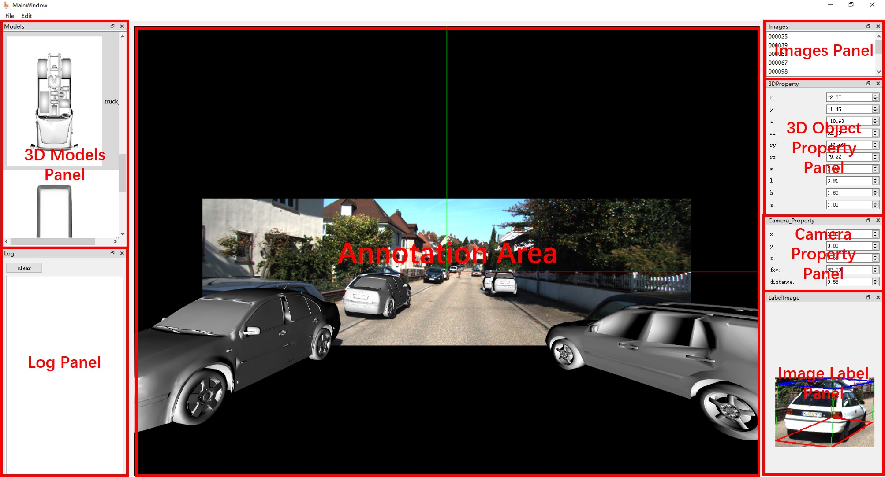
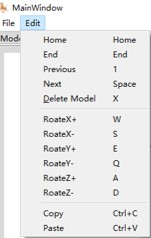

# Usage 
The app have 6 panels and an anno1tation area, including:

1. 3D models panel. The panel is to load and show 3D models

2. Images panel, The panel is to load and show images

3. Log panel. The panel is to show log (currently, we don't have log)
   
4. 3D property panel. The panel is to show the property of the selected 3D model.

5. Camera property panel. The panel is to show the camera property, including, camera position x, y, z, fov, and distance. The fov is the only parameter that you can change. The camera property is free from the focus length. We have a proof in our paper.

6. Image label panel. For easy operation when you labeling, this panel will show the cropped images and 3D bounding boxes of the 3D model.

There are two menu items for file operation and editing operation.

| Names | dess | shortcut key|
|:---:|:---:|:---:|
|Load Scenes| Load the scenes including the 3D model, images, annotation file| ctrl+o|
|save scenes| Save the scenes| ctrl+s|
|Home| go to the first image| home|
|End | go to the last image | end|
|previous | go to the previous image | 1 |
|next | go to the next image | space|
|delete model| delete the selected model | x |
|rotate X+ | roate along the x axis of the model clockwise | w |
|rotate X- | roate along the x axis of the model anticlockwise | s |
|rotate Y+ | roate along the y axis of the model clockwise | e |
|rotate Y- | roate along the y axis of the model anticlockwise | q |
|rotate Z+ | roate along the z axis of the model clockwise | a |
|rotate Z- | roate along the z axis of the model anticlockwise | d |
|copy| copy the selected model | ctrl + c|
|paste| paste the selected model | ctrl + v|

Mouse operation in annotation area

|operation | desc|
|:---:|:---:|
|left mouse click| select a model|
|left mouse click + move| rotate the selected model|
|right mouse click| select a model |
|right mouse move | move the object along the Z-axis in the world coordinate|